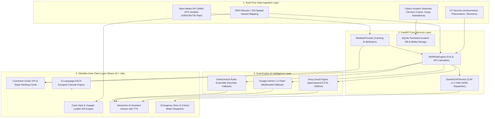

# ??? NER-LENS System Architecture & Engineering Specification

This document provides the technical architecture, mathematical foundations, data ingestion pipelines, and multi-agent AI design for the **NER-LENS Landslide Early Warning & Geotechnical Intelligence Platform**.

---

## 1. High-Level Architecture Diagram



---

## 2. Geotechnical Physics & Risk Formulation

The risk assessment engine operates on a multi-parameter ensemble combining **Limit Equilibrium Slope Stability (FoS)**, **Antecedent Precipitation Index (API)**, and **Ground Displacement Velocity**:

### A. Factor of Safety ($\text{FoS}$) Formula
Using the infinite slope stability model with steady-state seepage:

$$\text{FoS} = \frac{c' + (\gamma \cdot z \cdot \cos^2\beta - u) \tan\phi'}{\gamma \cdot z \cdot \sin\beta \cdot \cos\beta}$$

Where:
- $c'$: Effective Soil Cohesion ($\text{kPa}$)
- $\phi'$: Effective Angle of Internal Friction ($^\circ$)
- $\gamma$: Saturated Unit Weight of Soil ($\text{kN/m}^3$)
- $z$: Depth to Failure Slip Surface ($\text{m}$)
- $\beta$: Slope Incline Angle ($^\circ$)
- $u$: Pore Water Pressure measured by piezometers ($\text{kPa}$)

### B. Antecedent Precipitation Index ($\text{API}$)
Calculates cumulative soil saturation over a 7-day memory decay function:

$$\text{API}_t = \sum_{i=1}^{7} k^i \cdot P_{t-i}$$

Where $k \approx 0.84$ is the hydrological decay coefficient and $P_{t-i}$ is the precipitation measured on day $t-i$.

### C. Composite Risk Score Algorithm ($0 - 100$)
$$\text{Risk Score} = w_1 \cdot (1 - \min(1, \frac{\text{FoS}}{2.0})) \times 100 + w_2 \cdot \left(\frac{\text{Rain}_{24\text{h}}}{\text{Threshold}}\right) \times 100 + w_3 \cdot \left(\frac{u}{u_{\text{crit}}}\right) \times 100$$

Weights: $w_1 = 0.45$, $w_2 = 0.35$, $w_3 = 0.20$.

| Risk Score | Risk Level | Operational State | Protocol |
|---|---|---|---|
| **80 - 100** | **CRITICAL** | Failure Imminent | Trigger Red Alert, sound sirens, close arterial roads (e.g. NH-310A), evacuate to safe shelters. |
| **60 - 79** | **HIGH** | High Instability | Warning bulletin issuance, restrict heavy vehicle transit, pre-position SDRF/NDRF. |
| **40 - 59** | **MODERATE** | Elevated Watch | Increased sensor polling rate (1 min intervals), inspect drainage culverts. |
| **0 - 39** | **LOW / NOMINAL** | Stable | Standard telemetry monitoring. |

---

## 3. Dual-LLM AI Routing & Failover Architecture

```
User Query / Automated Telemetry Trigger
                 ?
                 ?
     ?????????????????????????
     ? Ingest Live Context   ? (Slope angles, 24h rain, FoS, shelter distances, language)
     ?????????????????????????
                 ?
                 ?
     ?????????????????????????
     ?  Primary: Groq Cloud  ? (qwen/qwen3.6-27b @ ~280ms latency)
     ?????????????????????????
                 ?
        ???????????????????
        ?                 ?
    [ Success ]       [ Timeout / Rate Limit ]
        ?                 ?
        ?                 ?
   Return Reply     ?????????????????????????
                    ? Fallback 1: Gemini AI ? (gemini-1.5-flash)
                    ?????????????????????????
                                ?
                       ???????????????????
                       ?                 ?
                   [ Success ]       [ Network Error ]
                       ?                 ?
                       ?                 ?
                  Return Reply     ??????????????????????????
                                   ? Fallback 2: Heuristic  ? (Deterministic Rule Ensemble)
                                   ??????????????????????????
                                                ?
                                                ?
                                           Return Reply
```

---

## 4. Multilingual Unicode Strategy

To protect against OS console character degradation (Windows `cp1252` encoding corruption that creates `??????`), the translation dictionary `i18n.ts` uses **pure 7-bit ASCII Unicode escape sequences**:

```typescript
// Example: Telugu & Hindi in pure ASCII escape format
{
  code: 'te',
  label: 'Telugu',
  nativeLabel: '\u0C24\u0C46\u0C32\u0C41\u0C17\u0C41' // ??????
},
{
  code: 'hi',
  label: 'Hindi',
  nativeLabel: '\u0939\u093F\u0928\u094D\u0926\u0940' // ??????
}
```

The browser's JavaScript V8 engine parses these escapes directly into native Unicode glyphs with 100% fidelity.

---

## 5. Security & Authority Authentication

- **Token Storage**: `localStorage` cached encrypted token and user role profile.
- **Roles**:
  - `admin`: Full administrative calibration, sensor threshold tuning, red alert overrides.
  - `disaster_officer`: Early warning broadcast, shelter evacuation activation.
  - `field_officer`: Ground incident triage, sensor hardware maintenance.
  - `community_user`: View hazard alerts, find safe evacuation routes, submit citizen incident photos.
