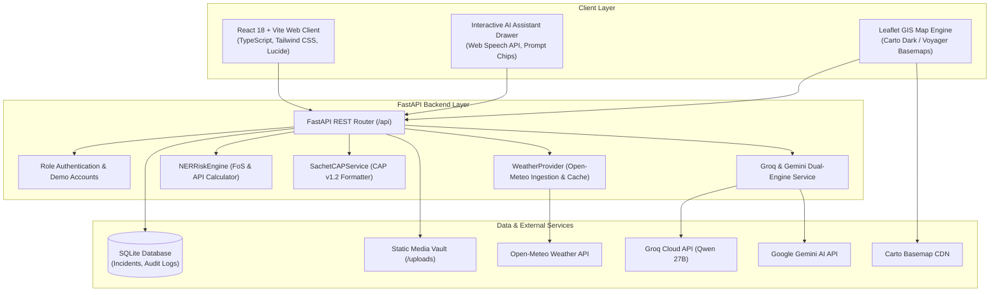

<div align="center">

# NER-LENS

**Landslide Risk Intelligence & Early Warning Decision Support System**

[](https://ner-lens-two.vercel.app/)
[](https://react.dev/)
[](https://fastapi.tiangolo.com/)
[](https://leafletjs.com/)
[](https://groq.com/)
[](https://ner-lens-two.vercel.app/)

### [NER-LENS | Landslide Early Warning & Geotechnical Intelligence Platform](https://ner-lens-two.vercel.app/)

*A unified, data-driven disaster intelligence platform designed for landslide risk monitoring, geotechnical telemetry visualization, early warning dissemination, and emergency decision support in the North Eastern Region of India.*

---

</div>

## Overview

Landslide-prone mountainous terrains generate fragmented data across multiple domains—subsurface geotechnical sensors, meteorological stations, spatial terrain models, citizen incident reports, and road network observations. In emergency situations, disaster officers and local administrations must correlate these separate sources quickly to make life-saving decisions.

**NER-LENS (North Eastern Region Landslide Early-warning & Notification System)** aggregates these operational feeds into a unified command center. It combines physics-based slope stability calculations (Factor of Safety), live rainfall telemetry from Open-Meteo, dual-layer Carto GIS mapping, CAP v1.2 alerting workflows, and an integrated multi-agent AI assistant into a responsive, multilingual interface.

---

## Why NER-LENS?

| Operational Challenge | How NER-LENS Solves It |
|---|---|
| **Fragmented Geotechnical Data** | Integrates in-place inclinometers, vibrating wire piezometers, and surface tiltmeters into a centralized dashboard with depth profiles and threshold monitoring. |
| **Delayed Weather Correlation** | Ingests real-time gridded rainfall telemetry (1h, 6h, 24h, 72h precipitation) via the Open-Meteo API to compute continuous Antecedent Precipitation Index (API) trends. |
| **Complex Stability Calculations** | Implements automated Limit Equilibrium slope stability algorithms to calculate real-time Factor of Safety (FoS) alongside heuristic risk scores. |
| **Language Barriers in Regional Outposts** | Provides 11 regional languages (English, Hindi, Telugu, Assamese, Bengali, Nepali, Manipuri, Mizo, Khasi, Garo, Nagamese) encoded with Unicode safety to prevent character corruption. |
| **Disjointed Emergency Protocols** | Standardizes warning generation into Common Alerting Protocol (CAP v1.2) format with direct routing to designated safe shelters and arterial road status monitoring. |

---

## Key Capabilities

| Capability | What It Provides | Implementation Status |
|---|---|---|
| **Command Center Dashboard** | Displays regional risk index, critical slopes ranking, active warnings, live weather metrics, and spatial hazard distribution. | Fully Implemented |
| **Interactive GIS Risk Map** | Leaflet-based map with switchable Carto Dark Matter, Carto Voyager, and OpenStreetMap base layers, risk polygons, sensor pins, shelter markers, and road blockage lines. | Fully Implemented |
| **AI Risk Prediction Sandbox** | Interactive simulation sandbox to adjust slope angle, rainfall, soil moisture, and pore pressure with live Factor of Safety (FoS) computation and AI diagnostic reports. | Fully Implemented |
| **Early Warnings & CAP Alerts** | Management interface for CAP v1.2 warning bulletins with severity filters, broadcast logs, and operator acknowledgement workflows. | Fully Implemented |
| **Evacuation & Safe Shelters** | Designated shelter directory with live capacity tracking, contact details, distance calculation, and emergency routing recommendations. | Fully Implemented |
| **IoT Sensor Telemetry Network** | Detailed monitoring views for in-place inclinometers, piezometers, and tiltmeters with depth displacement charts and status thresholds. | Fully Implemented |
| **Real-Time AI Assistant** | Floating conversational AI drawer powered by Groq (`qwen/qwen3.6-27b`) and Google Gemini (`gemini-1.5-flash`) with live sensor context and Text-to-Speech support. | Fully Implemented |
| **Citizen & Field Hazard Reporting** | Incident reporting form supporting photo uploads, crack width measurements, GPS location tagging, and persistent SQLite storage. | Fully Implemented |
| **Emergency Mode & Siren Takeover** | Full-screen critical red alert dispatch interface with audible siren playback and emergency checklist for disaster officers. | Fully Implemented |
| **Live Open-Meteo Weather** | Automated meteorological ingestion tracking 1h, 6h, 24h, 72h precipitation, temperature, humidity, and wind speed. | Fully Implemented |
| **Multilingual Support (11 Languages)** | Instant interface localization across 11 Indic languages using ASCII Unicode escape dictionaries. | Fully Implemented |
| **Authority Role-Based Access** | Authentication system with one-click demo personas (Admin, Disaster Officer, Field Officer, Community User). | Fully Implemented |

---

## System Workflow

```
[ Data Ingestion Layer ]
  +-- In-Place Inclinometers, Piezometers, Tiltmeters (IoT Telemetry)
  +-- Open-Meteo WMO GFS Gridded Precipitation Stream (1h, 6h, 24h, 72h)
  +-- ISRO Bhuvan / GSI Spatial Lithology & Hazard Baselines
  +-- Citizen & Field Incident Submissions (Photos, Crack Widths, GPS)
            |
            v
[ Processing & Physics Core ]
  +-- Factor of Safety (FoS) Limit Equilibrium Calculation
  +-- Antecedent Precipitation Index (API 72h / 7d Saturation Decay)
  +-- Multi-Parameter Composite Risk Scoring (0 - 100)
  +-- SQLite Persistent Data Vault & Image Storage
            |
            v
[ AI Intelligence & Reasoning Layer ]
  +-- Primary: Groq Ultra-Low Latency Inference (qwen/qwen3.6-27b)
  +-- Secondary: Google Gemini 1.5 Flash Multimodal Fallback
  +-- Rule-Based Heuristic Safety Ensemble (Offline Fallback)
            |
            v
[ Operational Dissemination Layer ]
  +-- Command Center Dashboard & Live Sensor Telemetry
  +-- Carto Dark Matter / Voyager Interactive GIS Layer
  +-- CAP v1.2 Standardized Warning Bulletins & Broadcast Logs
  +-- Designated Safe Shelter Evacuation & Road Clearance Guidance
  +-- Fullscreen Emergency Mode with Siren Dispatch
```

---

## Architecture



### Component Breakdown

#### Frontend (`/frontend`)
- **Framework**: React 18 with TypeScript and Vite
- **Styling**: Tailwind CSS with custom Obsidian Dark design system
- **Icons**: Lucide React
- **Mapping**: Leaflet and React-Leaflet with Carto Dark Matter, Carto Voyager, and OpenStreetMap tiles
- **Audio & Speech**: Web Speech API for Text-to-Speech synthesis and HTML5 Audio for emergency siren playback
- **State Management**: React Context (`AppContext.tsx`) with localStorage persistence

#### Backend (`/backend`)
- **Framework**: FastAPI (Python 3.10+) with Uvicorn ASGI server
- **Validation**: Pydantic v2 data models and schemas
- **Storage**: SQLite database for persistent incident logging and audit trails
- **HTTP Client**: `httpx` and `urllib` for external service calls
- **CORS**: Configured for local development and production domains

#### External Integrations
- **Carto Basemap API**: Authenticated raster tiles for dark and topographic cartography
- **Open-Meteo API**: Live WMO GFS meteorological stream (no API key required)
- **Groq API**: High-throughput, sub-second LLM inference using `qwen/qwen3.6-27b`
- **Google Gemini API**: Multimodal reasoning fallback using `gemini-1.5-flash`

---

## Geotechnical Formulations

The risk computation engine combines limit equilibrium stability analysis with antecedent rainfall tracking:

### 1. Factor of Safety (FoS)
Calculated using the infinite slope stability model with steady-state groundwater seepage:

$$\text{FoS} = \frac{c' + (\gamma \cdot z \cdot \cos^2\beta - u) \tan\phi'}{\gamma \cdot z \cdot \sin\beta \cdot \cos\beta}$$

Where:
- $c'$: Effective Soil Cohesion (kPa)
- $\phi'$: Effective Angle of Internal Friction (degrees)
- $\gamma$: Saturated Unit Weight of Soil (kN/m3)
- $z$: Depth to Failure Slip Surface (m)
- $\beta$: Slope Gradient Angle (degrees)
- $u$: Pore Water Pressure from Piezometers (kPa)

### 2. Antecedent Precipitation Index (API)
Quantifies cumulative soil moisture saturation over a 7-day memory decay window:

$$\text{API}_t = \sum_{i=1}^{7} k^i \cdot P_{t-i}$$

Where $k \approx 0.84$ is the hydrological recession coefficient and $P_{t-i}$ is the precipitation measured on day $t-i$.

### 3. Composite Risk Score (0 - 100)
$$\text{Risk Score} = 0.45 \cdot \left[1 - \min\left(1, \frac{\text{FoS}}{2.0}\right)\right] \times 100 + 0.35 \cdot \left(\frac{\text{Rain}_{24\text{h}}}{\text{Threshold}}\right) \times 100 + 0.20 \cdot \left(\frac{u}{u_{\text{crit}}}\right) \times 100$$

---

## Multilingual Support

The application features complete interface localization across **11 languages** with native typography support:

| Code | Language | Native Label | Script / Font |
|---|---|---|---|
| `en` | **English** | English | Inter, JetBrains Mono |
| `hi` | **Hindi** | हिन्दी | Noto Sans Devanagari |
| `te` | **Telugu** | తెలుగు | Noto Sans Telugu |
| `as` | **Assamese** | অসমীয়া | Noto Sans Bengali |
| `bn` | **Bengali** | বাংলা | Noto Sans Bengali |
| `ne` | **Nepali** | नेपाली | Noto Sans Devanagari |
| `mni` | **Manipuri** | মৈতৈলোন | Noto Sans Bengali |
| `lus` | **Mizo** | Mizo Ṭawng | Inter (Latin Extended) |
| `kha` | **Khasi** | Ka Ktien Khasi | Inter |
| `grt` | **Garo** | A·chik | Inter |
| `nag` | **Nagamese** | Nagamese | Inter |

*All strings in `src/lib/i18n.ts` are encoded using standard 7-bit ASCII escape sequences to prevent character corruption across different operating system locales.*

---

## Repository Structure

```
Landslide/
├── backend/
│   ├── app/
│   │   ├── api/v1/
│   │   │   └── endpoints.py         # REST API routes (dashboard, AI, weather, sensors, shelters)
│   │   ├── models/
│   │   │   └── schemas.py           # Pydantic schemas, CAP v1.2 alert definitions
│   │   ├── providers/
│   │   │   ├── weather_provider.py  # Open-Meteo live rainfall ingestion and cache
│   │   │   └── incident_provider.py # Persistent SQLite incident database
│   │   ├── risk_engine/
│   │   │   └── calculator.py        # Geotechnical FoS and composite risk algorithms
│   │   ├── services/
│   │   │   ├── groq_service.py      # Groq and Gemini dual-engine AI connector
│   │   │   ├── sachet_cap.py        # CAP v1.2 alert formatting
│   │   │   └── store.py             # In-memory telemetry cache and defaults
│   │   └── main.py                  # FastAPI application entrypoint and CORS config
│   └── requirements.txt             # Backend Python dependencies
│
├── frontend/
│   ├── src/
│   │   ├── components/
│   │   │   ├── AIAssistantDrawer.tsx# Real-time conversational AI drawer with TTS
│   │   │   ├── AppLayout.tsx        # Shell layout, navigation, authority bar, siren
│   │   │   ├── AppLogo.tsx          # Custom tactical topographical vector logo
│   │   │   ├── EmergencyMode.tsx    # Critical red alert takeover and siren
│   │   │   ├── GisMap.tsx           # Carto Dark / Voyager Leaflet GIS map
│   │   │   └── LiveWeatherCard.tsx  # Open-Meteo live weather and rainfall card
│   │   ├── context/
│   │   │   └── AppContext.tsx       # Global application state and multilingual context
│   │   ├── lib/
│   │   │   └── i18n.ts              # 11-language Unicode translation dictionaries
│   │   ├── pages/
│   │   │   ├── Dashboard.tsx        # Primary command center dashboard
│   │   │   ├── Evacuation.tsx       # Safe shelter routing and road clearance
│   │   │   ├── Login.tsx            # Authority authentication and demo accounts
│   │   │   ├── Prediction.tsx       # AI risk simulation sandbox and FoS modeling
│   │   │   ├── ReportHazard.tsx     # Citizen and field officer hazard reporting
│   │   │   ├── Sensors.tsx          # IoT inclinometer and piezometer network
│   │   │   └── Warnings.tsx         # CAP v1.2 early warning management
│   │   ├── App.tsx                  # Root routing and view switcher
│   │   └── main.tsx                 # React DOM entrypoint
│   ├── index.html                   # HTML template with Google Indic fonts
│   ├── package.json                 # Frontend dependencies and build scripts
│   └── vite.config.ts               # Vite build configuration
│
├── ARCHITECTURE.md                  # Detailed engineering and mathematical specifications
├── vercel.json                      # Vercel deployment configuration
└── README.md                        # Master project documentation
```

---

## API Reference Guide

### AI Intelligence Endpoints

#### 1. Interactive AI Assistant Chat
```http
POST /api/ai/chat
Content-Type: application/json

{
  "message": "What is the critical risk level at Mangan Ridge right now?",
  "language": "en"
}
```
**Response:**
```json
{
  "reply": "Mangan Ridge is currently under CRITICAL alert with a risk score of 88/100 and Factor of Safety (FoS) of 1.08. 24h rainfall has reached 285mm, resulting in 94% soil moisture saturation. NH-310A is blocked. Immediate evacuation to Mangan Government HSS Shelter (1.8km) is recommended.",
  "engine": "Groq Ultra-Fast Qwen/Llama Cloud",
  "language": "en"
}
```

#### 2. Geotechnical Failure Diagnosis
```http
POST /api/ai/assess
Content-Type: application/json

{
  "location": "Mangan Ridge (North Sikkim)",
  "slope_deg": 44.5,
  "rainfall_24h_mm": 285.0,
  "soil_moisture": 94.0,
  "pore_pressure_kpa": 48.2,
  "lang": "en"
}
```

### Meteorological Endpoints

#### Live Open-Meteo Weather
```http
GET /api/weather/live?lat=27.508&lng=88.528&location_name=Mangan
```
**Response:**
```json
{
  "location_name": "Mangan",
  "latitude": 27.508,
  "longitude": 88.528,
  "temperature_c": 21.8,
  "humidity_percent": 92,
  "weather_condition": "Heavy Rain",
  "rainfall_1h_mm": 12.4,
  "rainfall_6h_mm": 68.2,
  "rainfall_24h_mm": 285.0,
  "rainfall_72h_mm": 510.0,
  "source_agency": "Open-Meteo AWS Telemetry (WMO GFS Gridded Ingestion)",
  "status": "LIVE",
  "is_live": true
}
```

### Core Data Endpoints

| Endpoint | Method | Description |
|---|---|---|
| `/api/dashboard` | `GET` | Summary statistics, regional risk index, critical slopes, and active warnings count. |
| `/api/locations` | `GET` | Full list of monitored slopes with geotechnical properties, FoS, and road status. |
| `/api/sensors` | `GET` | IoT sensor telemetry including inclinometer depths and piezometer readings. |
| `/api/shelters` | `GET` | Designated safe evacuation shelters with capacities and distance metrics. |
| `/api/warnings` | `GET` | Active CAP v1.2 early warning bulletins. |
| `/api/incidents` | `GET` / `POST` | Retrieve and submit field hazard incident reports with photo uploads. |

---

## Local Setup & Installation

### Prerequisites
- Python 3.10 or higher
- Node.js 18 or higher (with npm)
- Git

### 1. Clone the Repository
```bash
git clone https://github.com/your-username/ner-lens.git
cd ner-lens
```

### 2. Backend Setup (FastAPI)
```bash
cd backend

# Create and activate virtual environment
python -m venv venv
# On Windows:
venv\Scripts\activate
# On Linux/macOS:
source venv/bin/activate

# Install dependencies
pip install -r requirements.txt

# Start FastAPI development server
python -m uvicorn app.main:app --host 127.0.0.1 --port 8000 --reload
```
*The backend API will be available at `http://127.0.0.1:8000`. Interactive OpenAPI documentation is accessible at `http://127.0.0.1:8000/docs`.*

### 3. Frontend Setup (React + Vite)
```bash
# Open a new terminal window
cd frontend

# Install npm dependencies
npm install

# Start Vite development server
npm run dev
```
*The web client will be available at `http://localhost:5173`.*

---

## Authority Sign In & Demo Personas

The application includes four pre-calibrated one-click demo personas on the Authority Sign In screen:

| Role | Email | Description | Permissions |
|---|---|---|---|
| **Admin / SDMA Director** | `admin@nerlens.gov.in` | State Disaster Management Authority Director | Full system calibration, sensor threshold tuning, emergency red alert overrides. |
| **Disaster Officer** | `officer@ndma.gov.in` | National Disaster Management Authority Officer | Warning bulletin issuance, CAP alert broadcasting, shelter evacuation oversight. |
| **Field Officer** | `field@gsi.gov.in` | Geological Survey of India Field Engineer | Sensor calibration, ground telemetry validation, crack measurement logging. |
| **Community User** | `citizen@nerlens.org` | Resident / Community Member | View localized risk alerts, access designated safe shelters, report hazards. |

---

## Hardware & IoT Sensor Specifications

The platform is designed to interface with standard geotechnical monitoring instrumentation:

| Sensor Type | Parameter Measured | Sampling Rate | Measurement Range & Accuracy |
|---|---|---|---|
| **In-Place Inclinometers (IPI)** | Subsurface lateral shear displacement across slip planes | 60 seconds | $\pm 30^\circ$, $0.01\text{ mm/m}$ resolution |
| **Vibrating Wire Piezometers** | Pore water pressure ($u$) in saturated soil layers | 60 seconds | $0 - 1000\text{ kPa}$, $\pm 0.1\%$ Full Scale |
| **MEMS Surface Tiltmeters** | Surface slope inclination (dip and azimuth) | 30 seconds | Dual-axis $\pm 15^\circ$, $0.001^\circ$ resolution |
| **Tipping Bucket Rain Gauges** | High-resolution precipitation intensity | Event-based | $0.2\text{ mm/tip}$, $0 - 500\text{ mm/hr}$ |

---

## Deployment Configuration

The repository includes pre-configured settings for deploying to Vercel:

- **Frontend Build Command**: `cd frontend && npm install && npm run build`
- **Output Directory**: `frontend/dist`
- **Vercel Config**: `vercel.json` routes all client-side paths to `index.html` for single-page application routing.
- **Production URL**: [https://ner-lens-two.vercel.app/](https://ner-lens-two.vercel.app/)

---

## Important Notes & Limitations

1. **Demonstration Dataset**: The monitored slope profiles, shelter listings, and historical landslide events included in the initial database are pre-calibrated baseline datasets representing key high-risk corridors in North East India (Mangan, Sohra, Champhai, Dima Hasao, Kohima, Kurseong, Tawang).
2. **Weather Telemetry**: Live weather observations are fetched in real-time from the Open-Meteo API using coordinate geocoding with in-memory caching to avoid rate-limiting.
3. **AI Fallback Mechanism**: If the Groq API key or network connection is unavailable, the AI system automatically attempts Google Gemini before gracefully degrading to deterministic geotechnical heuristic rules.

---

## Contributing & Development

Contributions to enhance NER-LENS are welcome. Recommended areas for ongoing development:

1. **Additional Sensor Adapters**: Integrating Modbus/RS-485 and LoRaWAN IoT gateway ingestion pipelines.
2. **Offline Mesh Syncing**: Enhancing service worker caching for complete offline operation in remote valleys.
3. **Automated Drone Imagery Ingestion**: Adding aerial orthomosaic and DEM diffing workflows for scarp change detection.

```bash
# Branch convention
git checkout -b feature/your-feature-name

# Run frontend build checks
cd frontend && npm run build
```

---

<div align="center">
  <sub>NER-LENS • North Eastern Region Landslide Early-warning & Notification System</sub>
</div>
